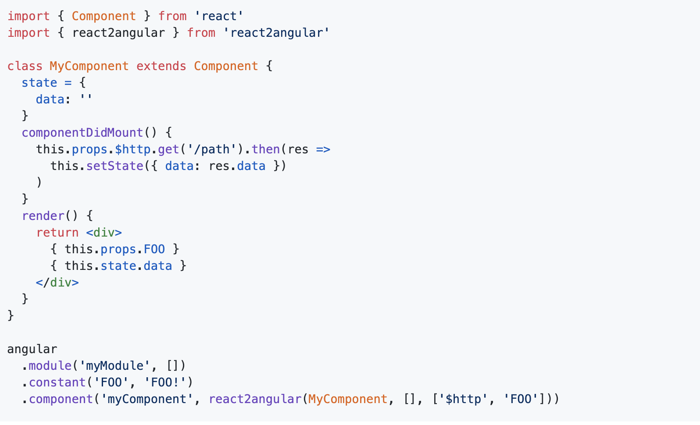
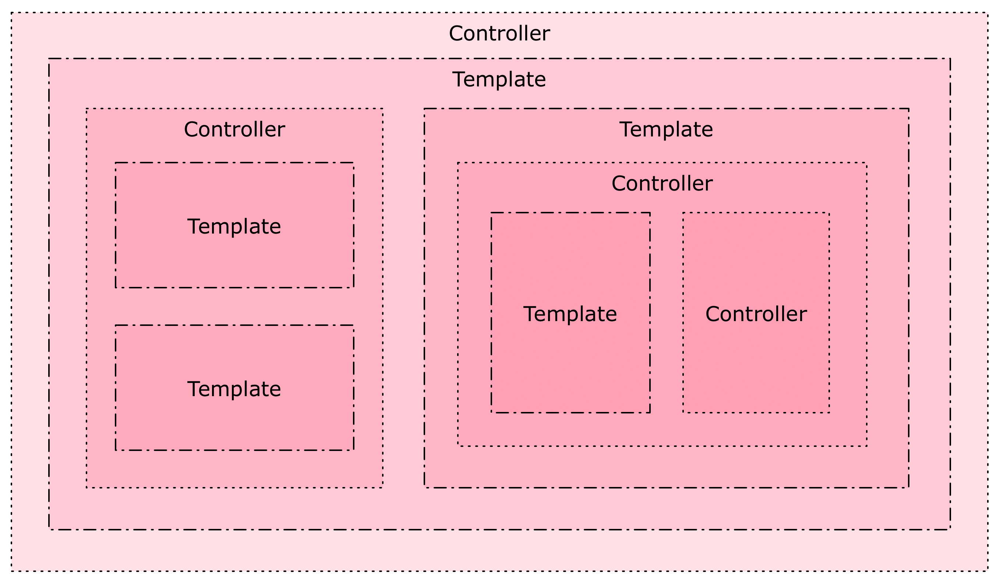
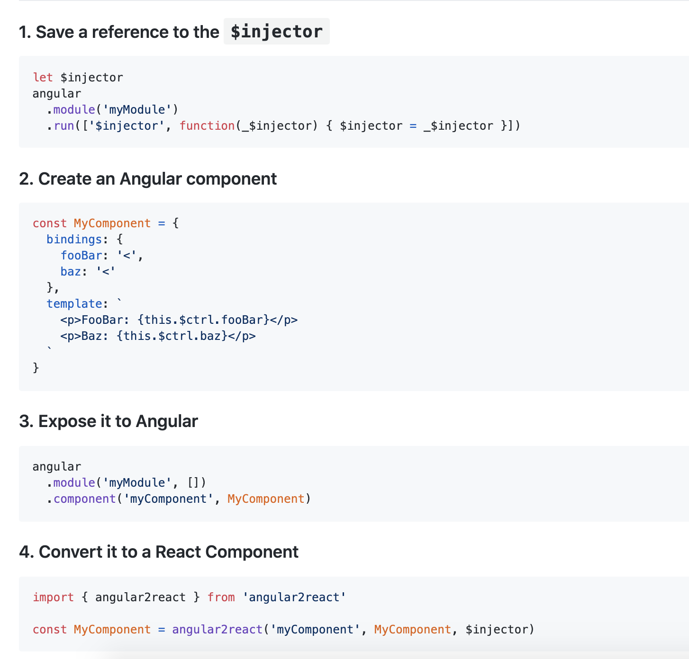

## Background

Grunt and Webpack are not directly comparable, since they are technically different categories of thing, with some overlap.

### Grunt

- Grunt is a **task-runner**. You give it a JSON file (Gruntfile) that says 'do this, then do that'. Kind of like npm scripts. 
- What it does (in the context of our project) is that it takes angular *modules* (the `module` in angular 1.x are not really modules in the ES6 sense...<sup>[1](#footnote1)</sup>), compiles, minifies, lints, and concatenates them in the right order into one big file; 

- Reasons people replaced it:
  - wanted specialized tools for generating build output (bundles). Mostly people use Webpack for this now
  - people wanted simpler task runners: these people use npm scripts
  - people wanted more easily-customizable task runners that required fewer plugins: these people switched to **gulp**

<a name="footnote1">Note 1: </a> 

<sup> ES modules are code files that import or export something while angular modules organize the application into cohesive blocks of functionality. ES modules organize our code while angular modules organize our application. ES modules modularize our code while angular modules modularize our application. ES modules promote code reuse while angular modules promote application boundaries. </sup>

### Webpack

- Webpack is a bundler; as its name indicates, it wraps modules in functions, returns the value needed for running the code; bundling all js/css/html files into one or (multiple js/css/html files if we have multiple entry points) in the build process 

- Modules are imported or required; (for es6+) babel turns the imported modules into common.js (the `require` syntax), 


- Webpack's main advantages:
  - can output multiple .js files, and at runtime the browser will dynamically load what it needs. 
  - Neat way to specify dependencies: you can `require('foo.css')` if you have a "Loader", which is a plugin for file types other than .js (e.g., css/sass/html etc.)
  - Has built-in ways to minify code.
  - Works well with Babel


## To migrate or not to migrate? It is a question. 

### A few things to consider: 
1. How do we resolve dependencies? We don't have something similar to `require` or `import` in angular 1.x. This is a technical problem that needs more investigation. We can replace all `<script></script>` tags using regex, but there will probably a lot of broken dependencies. 

Here's a blog post of [how someone did the migration](https://medium.com/appifycanada/migrate-to-webpack-from-grunt-bower-legacy-build-system-344526f47873)
and [their dev process](https://github.com/icgc-dcc/dcc-portal/commit/6bd5a47dad0217ccaf8f76b5d6a24b455d568f65)

2. Is it worth the time to migrate, if Grunt currently works well? Given that Grunt is a task runner with some build functionalities, maybe we can just integrate Webpack with Grunt?

See a possible way of using Webpack with Grunt: https://github.com/webpack-contrib/grunt-webpack 

3. An **alternative**: leave the existing apps the way they are, build new features on the front end with React. Each React app has its own Webpack configuration. To have the React apps communicate with the Angular apps, we can either wrap React components inside Angular apps or the other way around. 

## Two possible solutions (re: althernative) 
1. **adding react components in angular 1.x**
 (react2angular: https://github.com/coatue-oss/react2angular)
 
create React Component, expose it to Angular

 
then we can use it with Angular code: 
 
```html
<my-component
  foo-bar="3"
  baz="'baz'"
></my-component>
```

 **caveat**: The solution uses angular components, which don't seem to be what we used in ws/frontend? I haven't looked through all the code yet, but what we have seemed to be controllers and templates instead of components? (Correct me if I am wrong). If that's the case, don't worry. We can easily wrap controllers and templates into components: 
 

 see details here: https://teropa.info/blog/2015/10/18/refactoring-angular-apps-to-components.html

2. **adding angular 1.x to react**
(angular2react: https://github.com/coatue-oss/angular2react)


**caveat**: we have a massive angular codebase. will need to discuss how to gradually do that. 

